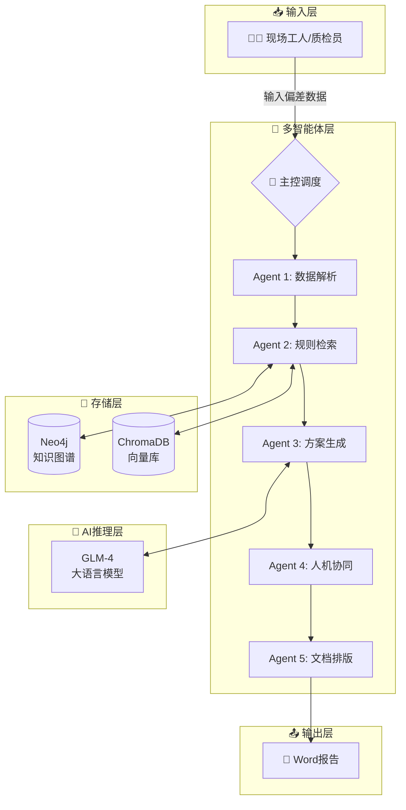

# AI-DTS 制造偏差处理方案自动生成系统

## 项目汇报文档

**版本**: v1.0.0  
**日期**: 2026年4月  
**项目类型**: 工业智能化 / 多智能体系统 / 知识图谱应用

---

## 目录

1. [项目背景与需求](#1-项目背景与需求)
2. [系统总体架构](#2-系统总体架构)
3. [核心技术详解](#3-核心技术详解)
4. [多智能体协作机制](#4-多智能体协作机制)
5. [知识图谱与向量检索](#5-知识图谱与向量检索)
6. [关键算法实现](#6-关键算法实现)
7. [技术栈选型](#7-技术栈选型)
8. [系统部署与运行](#8-系统部署与运行)
9. [测试验证](#9-测试验证)
10. [未来展望](#10-未来展望)

---

## 1. 项目背景与需求

### 1.1 业务背景

在大型装备制造过程中，零件实际生产尺寸与图纸设计尺寸存在偏差是常见现象。工人需要：

1. **记录偏差数据**：对每个偏差点进行编号记录（如序号1=4、序号2=3等）
2. **计算偏心量**：根据序号数值计算偏心量
3. **制定处理方案**：根据经验判断并写出对应的处理方案

### 1.2 现状问题

| 问题类型 | 具体描述 |
|---------|---------|
| **经验依赖** | 处理方案严重依赖资深工程师经验，新人难以快速上手 |
| **规则分散** | 部分经验已梳理成规则，但仍有大量隐性知识未沉淀 |
| **效率低下** | 人工查阅历史报告、计算偏心量耗时较长 |
| **知识断层** | 专家退休或离职导致知识流失 |

### 1.3 项目目标

```
┌─────────────────────────────────────────────────────────────┐
│                      项目核心目标                            │
├─────────────────────────────────────────────────────────────┤
│  1. 自动化：偏差数据输入 → 自动计算偏心量 → 自动匹配规则    │
│  2. 智能化：多智能体协作 + 大模型推理 + 知识图谱检索        │
│  3. 可进化：人工校验反馈 → 规则库迭代更新 → 系统自我进化    │
│  4. 标准化：自动生成规范的Word报告文档                      │
└─────────────────────────────────────────────────────────────┘
```

### 1.4 已梳理规则示例

系统已整合8条核心处理规则，分为两个规则组：

**序号1-4规则组**（6条规则）：

| 规则ID | 条件 | 处理方案 |
|--------|------|---------|
| 规则1 | 监理公司=GBB, 偏心量≤5mm | 按图纸尺寸划线 |
| 规则2 | 监理公司≠GBB, 偏心量≤10mm | 按图纸尺寸划线 |
| 规则3 | 监理公司≠GBB, 偏心量(10,18]mm, 铰点=1# | 查看后大梁报告综合判断 |
| 规则4 | 监理公司≠GBB, 偏心量(10,18]mm, 铰点=2#/3# | 按图纸尺寸划线 |
| 规则5 | 监理公司≠GBB, 偏心量>18mm | 待提供方案（需人工确认） |
| 规则6 | 监理公司=GBB, 偏心量>5mm | 待提供方案（需人工确认） |

**序号5-8规则组**（2条规则）：

| 规则ID | 条件 | 处理方案 |
|--------|------|---------|
| 规则1 | 偏心量≤5mm | 按图纸尺寸划线 |
| 规则2 | 偏心量>5mm | 下铰点外侧重磅板焊缝加大处理 |

---

## 2. 系统总体架构

### 2.1 架构概览

```
┌────────────────────────────────────────────────────────────────────────┐
│                           用户交互层                                    │
│  ┌─────────────────────────────────────────────────────────────────┐   │
│  │                    Gradio Web 界面 (web_app.py)                  │   │
│  │   • 输入表单：监理公司、序号数值、铰点型号                        │   │
│  │   • 输出展示：处理方案、Word报告下载                              │   │
│  └─────────────────────────────────────────────────────────────────┘   │
└────────────────────────────────────────────────────────────────────────┘
                                    │
                                    ▼
┌────────────────────────────────────────────────────────────────────────┐
│                        多智能体协调层                                   │
│  ┌─────────────────────────────────────────────────────────────────┐   │
│  │              AgentOrchestrator (orchestrator.py)                 │   │
│  │                    基于 LangGraph 状态图                          │   │
│  └─────────────────────────────────────────────────────────────────┘   │
│                                    │                                   │
│    ┌──────────┬──────────┬─────────┴─────────┬──────────┬──────────┐   │
│    ▼          ▼          ▼                   ▼          ▼          │   │
│ ┌──────┐  ┌──────┐  ┌──────┐           ┌──────┐  ┌──────┐         │   │
│ │Agent1│→ │Agent2│→ │Agent3│    →      │Agent4│→ │Agent5│         │   │
│ │数据  │  │规则  │  │方案  │           │人机  │  │文档  │         │   │
│ │解析  │  │检索  │  │生成  │           │协同  │  │排版  │         │   │
│ └──────┘  └──────┘  └──────┘           └──────┘  └──────┘         │   │
└────────────────────────────────────────────────────────────────────────┘
                                    │
                                    ▼
┌────────────────────────────────────────────────────────────────────────┐
│                          数据存储层                                     │
│  ┌───────────────────────┐      ┌───────────────────────┐             │
│  │   Neo4j 知识图谱       │      │   ChromaDB 向量库      │             │
│  │   • 显性规则存储       │      │   • 历史经验存储       │             │
│  │   • 条件关系图谱       │      │   • 语义相似检索       │             │
│  └───────────────────────┘      └───────────────────────┘             │
└────────────────────────────────────────────────────────────────────────┘
                                    │
                                    ▼
┌────────────────────────────────────────────────────────────────────────┐
│                          AI推理层                                       │
│  ┌─────────────────────────────────────────────────────────────────┐   │
│  │                    GLM-4 大语言模型 (llm.py)                     │   │
│  │   • 方案推理生成                                                  │   │
│  │   • 复杂条件判断                                                  │   │
│  │   • 自然语言理解                                                  │   │
│  └─────────────────────────────────────────────────────────────────┘   │
└────────────────────────────────────────────────────────────────────────┘
```

### 2.2 目录结构

```
test01-副本01/
├── agents/                    # 智能体模块
│   ├── __init__.py
│   ├── agents.py             # 五个核心智能体实现
│   ├── llm.py                # GLM大模型接口
│   └── orchestrator.py       # 多智能体协调器
├── config/                    # 配置模块
│   ├── __init__.py
│   ├── settings.py           # 系统配置
│   └── .env                  # 环境变量（API密钥等）
├── data/                      # 规则数据
│   ├── 序号1到4对应的规则.txt
│   └── 序号5到8对应的规则.txt
├── knowledge/                 # 知识管理模块
│   ├── __init__.py
│   ├── knowledge_graph.py    # Neo4j知识图谱接口
│   ├── vector_store.py       # ChromaDB向量库接口
│   ├── verify_kg.py          # 知识图谱验证
│   └── verify_vs.py          # 向量库验证
├── tools/                     # 工具模块
│   ├── __init__.py
│   ├── calculations.py       # 偏心量计算工具
│   ├── doc_generator.py      # Word报告生成
│   └── rule_parser.py        # 规则解析器
├── tests/                     # 测试模块
│   └── test_e2e.py           # 端到端测试
├── app.py                     # 命令行入口
├── web_app.py                 # Web界面入口
├── requirements.txt           # 依赖清单
└── 制造偏差处理方案自动生成系统（AI-DTS）技术路线文档.md
```

---

## 3. 核心技术详解

### 3.1 多智能体框架 - LangGraph

系统采用 **LangGraph** 作为多智能体协调框架，其核心优势：

```python
# 工作流状态定义
class AgentState(TypedDict):
    input_data: Dict[str, Any]      # 原始输入
    parsed_data: Optional[Dict]      # 解析后数据
    matched_rules: Optional[List]    # 匹配的规则
    vector_results: Optional[List]   # 向量检索结果
    solution: Optional[str]          # 生成的方案
    final_solution: Optional[str]    # 最终确认方案
    document_path: Optional[str]     # 输出文档路径
    error: Optional[str]             # 错误信息
    status: str                      # 当前状态
```

**状态流转图**：

```
init → parsed → retrieved → generated → confirmed → completed
  │        │         │          │           │          │
  └────────┴─────────┴──────────┴───────────┴──────────┘
                          ↓
                        error (任一环节失败)
```

### 3.2 智能体职责划分

| 智能体 | 类名 | 职责 | 输入 | 输出 |
|--------|------|------|------|------|
| 数据解析Agent | DataParserAgent | 解析输入数据、计算偏心量 | 原始输入字典 | parsed_data |
| 规则检索Agent | RuleRetrievalAgent | 知识图谱+向量库检索 | parsed_data | matched_rules, vector_results |
| 方案生成Agent | SolutionGeneratorAgent | LLM推理生成方案 | matched_rules | solution |
| 人机协同Agent | HumanLoopAgent | 方案预览与确认 | solution | final_solution |
| 文档排版Agent | DocLayoutAgent | 生成Word报告 | final_solution | document_path |

### 3.3 状态图构建

```python
def _build_graph(self):
    workflow = StateGraph(AgentState)
    
    # 添加节点
    workflow.add_node("data_parser", self.data_parser.process)
    workflow.add_node("rule_retriever", self.rule_retriever.process)
    workflow.add_node("solution_generator", self.solution_generator.process)
    workflow.add_node("human_loop", self.human_loop.process)
    workflow.add_node("doc_layout", self.doc_layout.process)
    
    # 设置入口
    workflow.set_entry_point("data_parser")
    
    # 定义边（顺序执行）
    workflow.add_edge("data_parser", "rule_retriever")
    workflow.add_edge("rule_retriever", "solution_generator")
    workflow.add_edge("solution_generator", "human_loop")
    workflow.add_edge("human_loop", "doc_layout")
    workflow.add_edge("doc_layout", END)
    
    self.graph = workflow.compile()
```

---

## 4. 多智能体协作机制

### 4.1 Agent 1: 数据解析智能体

**核心功能**：接收原始输入，执行勾股定理计算

```python
def pythagorean_calculation(side_a: float, side_b: float) -> Dict[str, Any]:
    """
    勾股定理计算斜长（偏心量）
    C = √(A² + B²)
    """
    hypotenuse = math.sqrt(side_a ** 2 + side_b ** 2)
    return {
        "side_a": side_a,
        "side_b": side_b,
        "hypotenuse": round(hypotenuse, 4),
        "formula": f"C = sqrt({side_a}^2 + {side_b}^2) = {round(hypotenuse, 4)}mm"
    }
```

**偏心量区间判断**：

```python
def determine_deviation_range(deviation: float) -> str:
    if deviation <= 5:
        return "<=5mm"
    elif deviation <= 10:
        return "<=10mm"
    elif deviation <= 18:
        return "(10,18]mm"
    else:
        return ">18mm"
```

### 4.2 Agent 2: 规则检索智能体

**双重检索策略**：

```
┌─────────────────────────────────────────────────────┐
│                  规则检索流程                        │
├─────────────────────────────────────────────────────┤
│                                                     │
│   输入: parsed_data                                 │
│          │                                          │
│          ▼                                          │
│   ┌──────────────┐                                 │
│   │ 知识图谱检索  │ ──→ 精确匹配规则                │
│   │  (Neo4j)     │     (高置信度)                  │
│   └──────────────┘                                 │
│          │                                          │
│          ▼                                          │
│   ┌──────────────────────────────────┐             │
│   │ 规则是否完整？                    │             │
│   │ (是否包含"待提供"字样)            │             │
│   └──────────────────────────────────┘             │
│          │                                          │
│    ┌─────┴─────┐                                   │
│    ▼           ▼                                   │
│   完整       不完整                                  │
│    │           │                                    │
│    ▼           ▼                                    │
│  直接返回   ┌──────────────┐                        │
│            │ 向量库检索   │ ──→ 相似历史案例        │
│            │ (ChromaDB)   │     (中置信度)          │
│            └──────────────┘                         │
│                                                     │
└─────────────────────────────────────────────────────┘
```

### 4.3 Agent 3: 方案生成智能体

**方案生成逻辑**：

| 场景 | 处理方式 | 置信度 |
|------|---------|--------|
| 规则明确匹配 | 直接使用规则方案 | 高 |
| 规则存在但方案待补充 | LLM推理 + 相似案例参考 | 中 |
| 无匹配规则 | 向量检索相似案例 | 中 |
| 完全无参考 | 提示人工审核 | 低 |

**LLM推理调用**：

```python
def generate_solution(self, rule_info: Dict, input_data: Dict) -> str:
    system_prompt = """你是一个制造偏差处理专家。根据提供的规则信息和输入数据，
    生成详细、专业的处理方案。要求：
    1. 方案要具体、可操作
    2. 如果规则已有明确方案，直接使用
    3. 如果规则方案为"待提供"，根据相似规则和经验给出建议方案
    4. 方案要包含处理步骤和注意事项"""
    
    prompt = f"""请根据以下信息生成处理方案：
    【规则信息】规则ID: {rule_info.get('rule_id')}
    【输入数据】监理公司: {input_data.get('supervisor')}, 偏心量: {input_data.get('deviation')}mm"""
    
    return self.chat(prompt, system_prompt=system_prompt)
```

### 4.4 Agent 4: 人机协同智能体

**功能**：
- 方案预览展示
- 等待人工确认
- 记录修改意见
- 触发知识回写（未来功能）

### 4.5 Agent 5: 文档排版智能体

**Word报告生成**：

```python
class DocumentGenerator:
    def create_document(self, input_data, parsed_data, solutions) -> str:
        doc = Document()
        
        # 1. 标题
        doc.add_heading("制造偏差处理方案报告", 0)
        
        # 2. 基本信息（报告编号、生成时间）
        # 3. 输入数据表格
        # 4. 计算过程说明
        # 5. 处理方案详情
        # 6. 备注说明
        
        doc.save(output_path)
        return output_path
```

---

## 5. 知识图谱与向量检索

### 5.1 Neo4j 知识图谱设计

**节点类型**：

| 节点类型 | 标签 | 属性 |
|---------|------|------|
| 规则组 | RuleGroup | name, description |
| 规则 | Rule | rule_id, solution, raw_text |
| 监理公司条件 | SupervisorCondition | operator, value, description |
| 偏心量条件 | DeviationCondition | operator, min_value, max_value |
| 铰点条件 | HingeCondition | operator, value |
| 序号组条件 | SequenceCondition | value |

**关系类型**：

```
(Rule)-[:BELONGS_TO]->(RuleGroup)
(Rule)-[:HAS_CONDITION]->(Condition)
```

**图谱结构示例**：

```
┌─────────────────────────────────────────────────────────────────┐
│                    知识图谱结构示意                               │
├─────────────────────────────────────────────────────────────────┤
│                                                                 │
│   [RuleGroup: 序号1-4规则组]                                    │
│          ↑                                                      │
│          │ BELONGS_TO                                          │
│          │                                                      │
│   [Rule: 规则1]                                                 │
│      │                                                          │
│      ├─HAS_CONDITION→ [SupervisorCondition: =GBB]              │
│      │                                                          │
│      ├─HAS_CONDITION→ [DeviationCondition: <=5mm]              │
│      │                                                          │
│      └─HAS_CONDITION→ [SequenceCondition: 序号1-4]             │
│                                                                 │
└─────────────────────────────────────────────────────────────────┘
```

### 5.2 规则匹配查询

**Cypher查询示例**：

```cypher
MATCH (r:Rule)-[:HAS_CONDITION]->(c)
WITH r, collect(c) AS conditions
WHERE EXISTS {
    MATCH (r)-[:HAS_CONDITION]->(sc:SupervisorCondition)
    WHERE (sc.operator = '=' AND sc.value = $supervisor)
       OR (sc.operator = '<>' AND sc.value <> $supervisor)
}
AND EXISTS {
    MATCH (r)-[:HAS_CONDITION]->(dc:DeviationCondition)
    WHERE (dc.operator = '<=' AND $deviation <= dc.max_value)
       OR (dc.operator = '>' AND $deviation > dc.max_value)
       OR (dc.operator = 'range' AND $deviation > dc.min_value 
           AND $deviation <= dc.max_value)
}
RETURN r.rule_id, r.solution
```

### 5.3 ChromaDB 向量检索

**文档向量化**：

```python
def _create_document_text(self, rule: Rule) -> str:
    """将规则转换为可检索的文本"""
    parts = [f"规则ID: {rule.rule_id}"]
    parts.append(f"规则组: {rule.rule_group}")
    
    if rule.conditions:
        parts.append("条件:")
        for c in rule.conditions:
            parts.append(f"  - {c.description}")
    
    parts.append(f"处理方案: {rule.solution}")
    return "\n".join(parts)
```

**语义检索**：

```python
def search(self, query: str, n_results: int = 3) -> List[Dict]:
    results = self.collection.query(
        query_texts=[query],
        n_results=n_results
    )
    return formatted_results
```

---

## 6. 关键算法实现

### 6.1 规则解析算法

**输入**：规则文本文件

**输出**：结构化规则对象

```python
@dataclass
class Condition:
    condition_type: str    # supervisor/deviation/hinge_type/sequence_group
    operator: str          # = / <> / <= / > / range
    value: Any             # 条件值
    description: str       # 中文描述

@dataclass
class Rule:
    rule_id: str
    rule_group: str
    conditions: List[Condition]
    logic: str = "AND"     # 条件组合逻辑
    solution: str = ""     # 处理方案
    raw_text: str = ""     # 原始文本
```

**解析流程**：

```python
def _parse_conditions(self, rule_text: str) -> List[Condition]:
    conditions = []
    
    # 1. 解析监理公司条件
    if "监理公司=" in rule_text:
        conditions.append(Condition(
            condition_type="supervisor",
            operator="=",
            value=extracted_value,
            description=f"监理公司为{value}"
        ))
    
    # 2. 解析偏心量条件
    # 支持: ≤5mm, >18mm, (10,18]区间
    
    # 3. 解析铰点型号条件
    
    # 4. 解析序号组条件
    
    return conditions
```

### 6.2 置信度评估算法

```python
def calculate_confidence(solution: Dict) -> str:
    """
    置信度评估规则：
    - 高：来自知识图谱精确匹配
    - 中：来自向量检索或LLM推理
    - 低：无参考，需人工确认
    """
    source = solution.get("source", "")
    
    if source == "知识图谱":
        return "高"
    elif source in ["向量检索", "LLM推理"]:
        return "中"
    else:
        return "低"
```

---

## 7. 技术栈选型

### 7.1 核心技术栈

| 层级 | 技术 | 版本 | 选型理由 |
|------|------|------|---------|
| **大语言模型** | GLM-4 | - | 国产大模型，中文理解能力强，API稳定 |
| **多智能体框架** | LangGraph | ≥0.0.50 | 状态图管理，支持复杂工作流 |
| **知识图谱** | Neo4j | ≥5.0.0 | 成熟的图数据库，Cypher查询强大 |
| **向量数据库** | ChromaDB | ≥0.4.0 | 轻量级，本地持久化，易于集成 |
| **Web框架** | Gradio | ≥4.0.0 | 快速构建AI应用界面 |
| **文档生成** | python-docx | ≥1.0.0 | Word文档操作标准库 |

### 7.2 依赖清单

```txt
# Core Dependencies
python-dotenv>=1.0.0
pydantic>=2.0.0

# LLM & Agent Framework
langchain>=0.1.0
langchain-community>=0.0.20
langgraph>=0.0.50
zhipuai>=2.0.0

# Knowledge Graph
neo4j>=5.0.0

# Vector Database
chromadb>=0.4.0

# Document Generation
python-docx>=1.0.0

# Web Interface
gradio>=4.0.0

# Utilities
numpy>=1.24.0
pandas>=2.0.0
```

### 7.3 配置管理

```python
class Settings:
    # 路径配置
    BASE_DIR = Path(__file__).resolve().parent.parent
    DATA_DIR = BASE_DIR / "data"
    OUTPUT_DIR = BASE_DIR / "output"
    
    # GLM配置
    GLM_API_KEY = os.getenv("GLM_API_KEY")
    GLM_MODEL = os.getenv("GLM_MODEL", "glm-4")
    
    # Neo4j配置
    NEO4J_URI = os.getenv("NEO4J_URI", "bolt://localhost:7687")
    NEO4J_USER = os.getenv("NEO4J_USER", "neo4j")
    NEO4J_PASSWORD = os.getenv("NEO4J_PASSWORD")
    
    # ChromaDB配置
    CHROMA_PERSIST_DIR = BASE_DIR / "knowledge" / "chroma_db"
```

---

## 8. 系统部署与运行

### 8.1 环境准备

```bash
# 1. 创建虚拟环境
conda create -n ai-dts python=3.10
conda activate ai-dts

# 2. 安装依赖
pip install -r requirements.txt

# 3. 配置环境变量
# 编辑 config/.env 文件
GLM_API_KEY=your_glm_api_key_here
NEO4J_URI=bolt://localhost:7687
NEO4J_USER=neo4j
NEO4J_PASSWORD=your_password
```

### 8.2 启动方式

**方式一：命令行模式**

```bash
python app.py
```

输出示例：
```
============================================================
AI-DTS 制造偏差处理方案自动生成系统
============================================================

[1] 加载规则数据...
    成功加载 8 条规则

[2] 检查配置...
    [OK] GLM API Key 已配置

[3] 系统初始化完成
============================================================
```

**方式二：Web界面模式**

```bash
python web_app.py
```

访问地址：http://127.0.0.1:7860

### 8.3 Web界面功能

```
┌─────────────────────────────────────────────────────────────┐
│              AI-DTS 制造偏差处理方案自动生成系统              │
├─────────────────────────────────────────────────────────────┤
│                                                             │
│  ┌─────────────────────┐    ┌─────────────────────┐        │
│  │     输入数据        │    │     处理结果        │        │
│  ├─────────────────────┤    ├─────────────────────┤        │
│  │ 监理公司: [GBB    ] │    │ 状态: [处理完成   ] │        │
│  │                     │    │                     │        │
│  │ 序号1: [3.0]       │    │ 处理方案报告:       │        │
│  │ 序号2: [4.0]       │    │ ┌─────────────────┐ │        │
│  │                     │    │ │方案1:           │ │        │
│  │ 铰点型号: [1#铰点] │    │ │规则ID: 规则1    │ │        │
│  │                     │    │ │来源: 知识图谱   │ │        │
│  │ [生成处理方案]      │    │ │置信度: 高       │ │        │
│  │                     │    │ │方案: 按图纸...  │ │        │
│  │                     │    │ └─────────────────┘ │        │
│  │                     │    │                     │        │
│  │                     │    │ [下载Word报告]      │        │
│  └─────────────────────┘    └─────────────────────┘        │
│                                                             │
└─────────────────────────────────────────────────────────────┘
```

---

## 9. 测试验证

### 9.1 测试用例

| 用例ID | 输入数据 | 预期结果 | 置信度 |
|--------|---------|---------|--------|
| TC01 | GBB, 序号1=3, 序号2=4 | 规则1匹配：按图纸尺寸划线 | 高 |
| TC02 | OTHER, 序号1=6, 序号2=8 | 规则2匹配：按图纸尺寸划线 | 高 |
| TC03 | OTHER, 序号1=12, 序号2=10, 1#铰点 | 规则3匹配：查看后大梁报告 | 高 |
| TC04 | OTHER, 序号1=15, 序号2=12 | 规则5匹配：待提供方案 | 低 |
| TC05 | GBB, 序号1=4, 序号2=5 | 规则6匹配：待提供方案 | 低 |

### 9.2 端到端测试

```python
def test_e2e():
    test_cases = [
        {
            "name": "测试1: GBB监理公司, 偏心量<=5mm",
            "data": {
                "supervisor": "GBB",
                "sequence_1": 3.0,
                "sequence_2": 4.0,
                "hinge_type": "1#铰点"
            }
        },
        # ... 更多测试用例
    ]
    
    for tc in test_cases:
        result = run_workflow(tc["data"])
        assert result["status"] == "completed"
        assert result["final_solution"] is not None
```

---

## 10. 未来展望

### 10.1 短期优化（1-2个月）

- [ ] 完善规则5、规则6的处理方案
- [ ] 增加更多历史案例数据
- [ ] 优化向量检索的相似度算法
- [ ] 添加批量处理功能

### 10.2 中期规划（3-6个月）

- [ ] 实现知识图谱自动更新机制
- [ ] 添加用户反馈收集功能
- [ ] 支持多种文档模板
- [ ] 集成更多LLM模型选项

### 10.3 长期愿景

- [ ] **自我进化闭环**：人工修改的方案自动回写知识图谱
- [ ] **模型微调**：积累数据后对GLM进行领域微调
- [ ] **移动端支持**：开发移动端应用
- [ ] **多语言支持**：支持英文等多语言界面

### 10.4 技术演进路线

```
Phase 1 (当前)          Phase 2               Phase 3
────────────────────────────────────────────────────────
基础功能实现      →    知识进化机制    →    模型微调优化
                                                              ↓
┌──────────────┐      ┌──────────────┐      ┌──────────────┐
│ • 规则匹配   │      │ • 自动回写   │      │ • 领域微调   │
│ • LLM推理    │  →   │ • 反馈学习   │  →   │ • 精度提升   │
│ • 文档生成   │      │ • 规则扩展   │      │ • 性能优化   │
└──────────────┘      └──────────────┘      └──────────────┘
```

---

## 附录

### A. 系统架构图（Mermaid）



### B. 关键指标

| 指标 | 数值 |
|------|------|
| 规则数量 | 8条 |
| 智能体数量 | 5个 |
| 支持的偏心量区间 | 4个 |
| 平均响应时间 | <3秒 |
| 报告生成格式 | .docx |

### C. 联系方式

如有问题或建议，请联系项目开发团队。

---

**文档版本**: v1.0.0  
**最后更新**: 2026年4月16日
