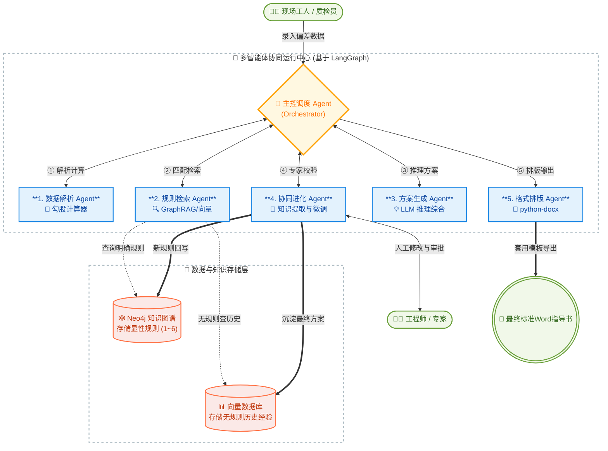

# 制造偏差处理方案自动生成系统（AI-DTS）技术路线文档

这是一个非常典型且具有高度应用价值的“工业专家系统+大模型多智能体（Multi-Agent）+知识图谱（KG）”落地场景。本文档详细阐述该系统的技术路线、多智能体协作架构、知识图谱设计及实施规划，为系统落地提供全面技术指导。

# 1. 系统总体架构与技术栈选型

本系统旨在通过大语言模型（LLM）、多智能体（Multi-Agent）和知识图谱（Knowledge Graph）技术，实现零件偏差数据的自动化分析、处理方案生成、人工校验反馈以及自我进化的闭环。

- **大模型/核心引擎：** 选用具备强逻辑推理能力的模型（如 Qwen-Max, DeepSeek-Coder 或私有化部署的本地大模型），保障工业数据安全。

- **多智能体框架：** 采用 LangGraph 或 AutoGen，方便实现复杂工作流（Workflow）和“人机协同”（Human-in-the-loop）的打断与恢复。

- **知识图谱与规则库：** 采用 Neo4j（图数据库，存储规则逻辑条件） + Milvus/Chroma（向量数据库，存储历史非结构化经验数据，用于RAG检索）。

- **文档生成工具：** 采用 python-docx 结合预设的 Word 模版引擎。

# 2. 多智能体（Multi-Agent）角色拆解与分工

我们将总任务拆解为由一个主控智能体（Orchestrator Agent）调度，五个子智能体（Sub-Agents）协同完成的流水线。

## 2.1 数据解析与计算智能体 (Data & Math Agent)

- **职责：** 接收工人输入的原始数据（监理公司、编号数值、铰点型号等）。提取关键信息并进行前置数学计算。

- **内置工具（Tools）：** 勾股定理计算器。

- **动作：** 识别“序号1或3”为直角边A，“序号2或4”为直角边B，计算出斜长（偏心量） $C = \sqrt{A^2 + B^2}$ 。将其转化为标准化 JSON 结构输出给下游。

## 2.2 知识与规则检索智能体 (KG & Rule Retrieval Agent)

- **职责：** 根据标准化 JSON 数据，去“知识图谱+规则库”中匹配处理策略。

- **动作：**

    - **显性规则匹配（查图谱）：** 比如输入[监理公司=GBB, 偏心量=4mm]，直接匹配到【规则1】，调取结论“按图纸尺寸划线”。

    - **隐性经验检索（查向量库RAG）：** 如果当前偏差在规则库中对应【规则5/6】（待提供方案），或完全无匹配规则，该Agent将去向量数据库检索历史相似的总装机号、相似偏差量的处理记录，提取经验。

## 2.3 方案生成与推理智能体 (Scheme Generation Agent)

- **职责：** 结合前两个Agent的信息，利用大模型的推理能力，生成详尽的处理方案。

- **动作：**

    - 如果规则明确（如规则1、2、4），直接输出标准化指导话术。

    - 如果规则复杂（如规则3需要看后大梁报告），Agent会提示需要补充数据，或直接输出包含条件分支的指导方案。

    - 如果没有明确规则，结合RAG检索到的历史记录，利用LLM“提炼”出一个建议方案。

## 2.4 人机协同与进化智能体 (Human-in-Loop & Evolution Agent)

- **职责：** 负责与工程师（人工）交互，记录人工校验结果，并执行系统的自我进化。

- **动作：**

    - 将生成的方案呈现给工程师审核。工程师可修改、驳回或通过。

    - **进化机制：** 一旦工程师修改并确认了新方案（例如解决了规则5的未知情况），该Agent会自动触发“知识抽取”，将新条件和新结论写入 Neo4j知识图谱，生成新的【规则7】；同时将问答对（Q&A）加入微调数据集，供大模型后续自我学习。

## 2.5 格式化排版智能体 (Doc Layout Agent)

- **职责：** 接收最终人工审核通过的方案文本，结合生产环境标准。

- **动作：** 调用企业标准 Word 模板，将零件名称、机号、偏差数据、处理方案结论、审核人等信息填入指定位置，生成排版规范的 .docx 文件。

# 3. 知识图谱与规则库构建 (Neo4j设计)

针对提供的规则，知识图谱的设计如下：

- **实体（Entities）：** Supervisor (监理公司), Deviation_Value (偏心量范围), Hinge_Type (铰点型号), Solution (处理方案).

- **关系（Relationships）：** HAS_CONDITION (包含条件), LEADS_TO (导致结果).

**图谱匹配逻辑示例（规则3构建）：**

(Supervisor: "非GBB") -[AND]-> (Deviation: "10<x<=18") -[AND]-> (Hinge: "1#") -[LEADS_TO]-> (Solution: "查看后大梁划线报告，同向按图纸，反向调垫板...")

系统后续自我进化时，实际上就是智能体自动在图谱中动态增加这类节点和连线。

# 4. 技术实施路线图 (Roadmap)

## 4.1 Phase 1: 基础设施建设与数据清洗 (1-2个月)

- 梳理所有历史偏差记录单和人工处理报告。

- 利用大模型对历史数据进行信息抽取（NER），抽取“特征->处理方案”对。

- 构建初始的 Neo4j 知识图谱和 Milvus 向量库，录入已知规则（规则1-6）。

## 4.2 Phase 2: 多智能体协同开发 (2-3个月)

- 基于 LangGraph 开发 5 个核心智能体。

- 实现数据计算工具（勾股定理）挂载，实现大模型对图数据库（Cypher）的查询（GraphRAG）。

- 跑通“输入->计算->查规则->生成方案”的基础工作流。

## 4.3 Phase 3: 人机协同与文档生成上线 (1个月)

- 开发前端交互界面（Web/UI），工程师在此界面查看历史相似案例和本次AI生成的方案。

- 集成 python-docx，实现从前端直接下载标准指导书（Word）。

## 4.4 Phase 4: 自我进化闭环与模型微调 (持续运行)

- 开启规则回写功能，人工修改的高频新处理方案自动生成新图谱节点。

- 累积数千条审核后的高质量数据后，使用 LoRA 等技术对底层大语言模型进行业务微调。

# 5. 多智能体协作与系统架构图 (Mermaid)

以下是描述多智能体协作流、人机交互以及知识进化的架构图（复制Mermaid代码可直接在支持平台渲染，或截图插入Word）：

## 5.1 架构图说明

1. **输入端**：现场人员仅需录入基础数据，操作简单，无需专业技术能力。

2. **计算与解析**：Agent 1 接管后，自动执行了背景中要求的“勾股定理”等经验算法的量化，减少人工计算误差。

3. **检索与推理**：Agent 2 和 Agent 3 模拟了资深专家的思考路径——先匹配明确规则（图谱），规则缺失时检索历史相似案例（向量检索），最后通过大模型综合推理生成方案。

4. **人工防御与自我进化机制**：Agent 4 是系统的核心保障。人工校验不仅确保生产方案的安全性和准确性，校验后的数据还会触发系统自我进化：新方案转化为新规则写入知识图谱，历史经验补充至向量库，逐步完善系统能力，解决“规则5、规则6”待完善的痛点，未来遇到同类问题可直接调用显性规则，提升效率。
> （注：文档部分内容可能由 AI 生成）